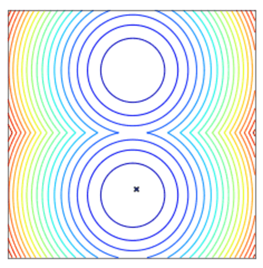

[](https://circleci.com/gh/facebookresearch/nevergrad/tree/master)

# Nevergrad - A gradient-free optimization platform


`nevergrad` is a Python 3.6+ library. It can be installed with:

```
pip install nevergrad
```

More installation options, including windows installation, and complete instructions are available in the "Getting started" section of the [**documentation**](https://facebookresearch.github.io/nevergrad/).

You can join Nevergrad users Facebook group [here](https://www.facebook.com/groups/nevergradusers/).

Minimizing a function using an optimizer (here `NGOpt`) is straightforward:

```python
import nevergrad as ng

def square(x):
    return sum((x - .5)**2)

optimizer = ng.optimizers.NGOpt(parametrization=2, budget=100)
recommendation = optimizer.minimize(square)
print(recommendation.value)  # recommended value
>>> [0.49971112 0.5002944]
```

`nevergrad` can also support bounded continuous variables as well as discrete variables, and mixture of those.
To do this, one can specify the input space:

```python
import nevergrad as ng

def fake_training(learning_rate: float, batch_size: int, architecture: str) -> float:
    # optimal for learning_rate=0.2, batch_size=4, architecture="conv"
    return (learning_rate - 0.2)**2 + (batch_size - 4)**2 + (0 if architecture == "conv" else 10)

# Instrumentation class is used for functions with multiple inputs
# (positional and/or keywords)
parametrization = ng.p.Instrumentation(
    # a log-distributed scalar between 0.001 and 1.0
    learning_rate=ng.p.Log(lower=0.001, upper=1.0),
    # an integer from 1 to 12
    batch_size=ng.p.Scalar(lower=1, upper=12).set_integer_casting(),
    # either "conv" or "fc"
    architecture=ng.p.Choice(["conv", "fc"])
)

optimizer = ng.optimizers.NGOpt(parametrization=parametrization, budget=100)
recommendation = optimizer.minimize(fake_training)

# show the recommended keyword arguments of the function
print(recommendation.kwargs)
>>> {'learning_rate': 0.1998, 'batch_size': 4, 'architecture': 'conv'}
```

Learn more on parametrization in the [**documentation**](https://facebookresearch.github.io/nevergrad/)!



*Convergence of a population of points to the minima with two-points DE.*


## Documentation

Check out our [**documentation**](https://facebookresearch.github.io/nevergrad/)! It's still a work in progress, don't hesitate to submit issues and/or PR to update it and make it clearer!


## Citing

```bibtex
@misc{nevergrad,
    author = {J. Rapin and O. Teytaud},
    title = {{Nevergrad - A gradient-free optimization platform}},
    year = {2018},
    publisher = {GitHub},
    journal = {GitHub repository},
    howpublished = {\url{https://GitHub.com/FacebookResearch/Nevergrad}},
}
```

## License

`nevergrad` is released under the MIT license. See [LICENSE](LICENSE) for additional details about it.
See also our [Terms of Use](https://opensource.facebook.com/legal/terms) and [Privacy Policy](https://opensource.facebook.com/legal/privacy).
