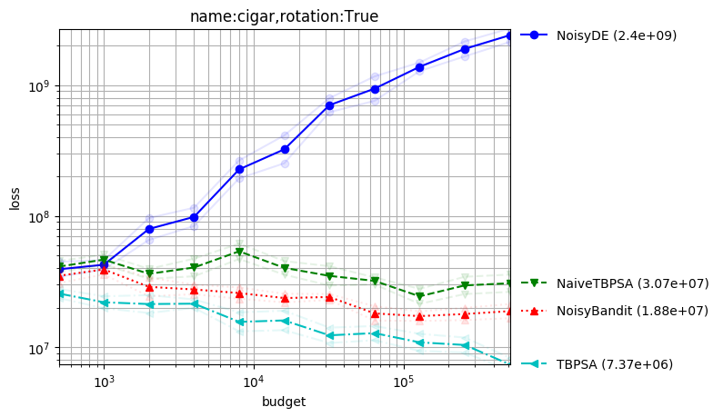
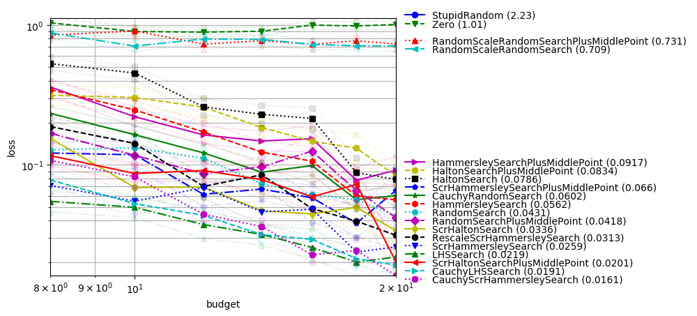
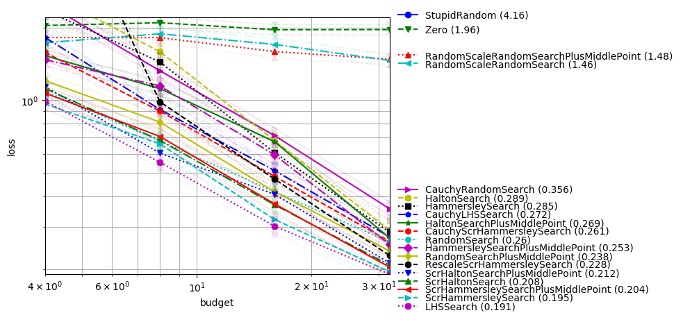
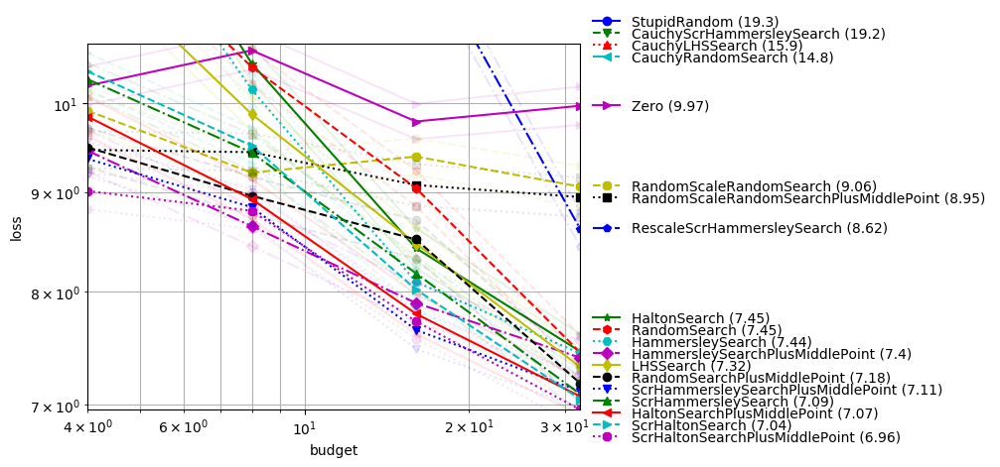
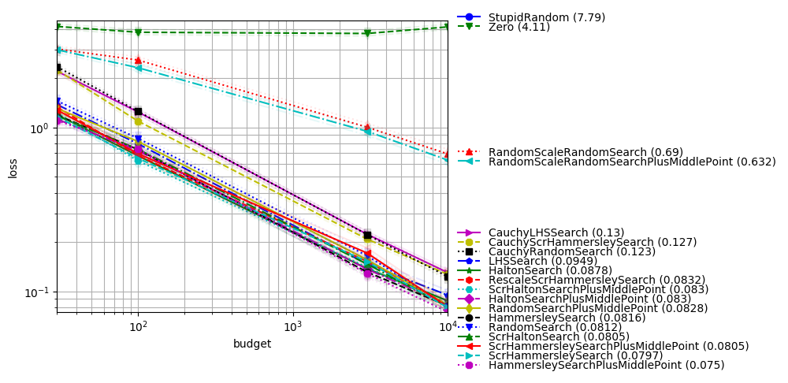
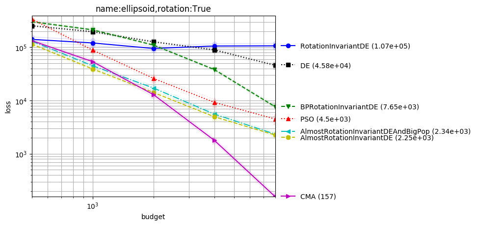
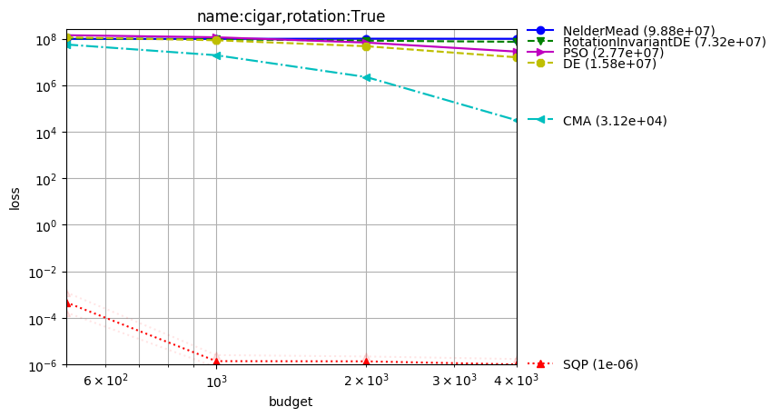
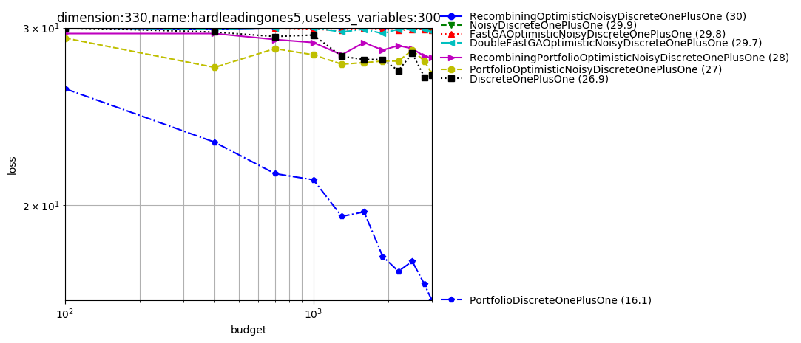
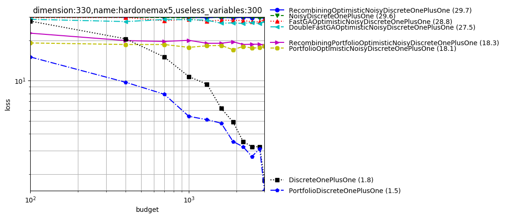

Examples of benchmarks
======================

The following figures are examples of algorithm benchmarks which can be generated very easily from the platform
In all examples, we use independent experiments for the different x-values; so that consistent rankings between methods, over several x-values, have a statistical meaning.

If you want to run the examples yourself, please make sure you have installed :code:`nevergrad` with the :code:`benchmark` flag (see :ref:`here <benchmarking>`).

Noisy optimization
------------------

Created with command:

.. code-block:: bash

    python -m nevergrad.benchmark noise --seed=12 --repetitions=10 --plot

Here the variance of the noise does not vanish near the optimum.
TBPSA uses the noise management principles of `pcCMSA-ES <https://homepages.fhv.at/hgb/New-Papers/PPSN16_HB16.pdf>`_ reaching fast convergence rates. We here compare it to a sample of our algorithms; but it performed very well also compared to many other methods.

One-shot optimization
---------------------

In dimension-11 with one feature
^^^^^^^^^^^^^^^^^^^^^^^^^^^^^^^^

Created with command:

.. code-block:: bash

    python -m nevergrad.benchmark dim10_select_one_feature --seed=12 --repetitions=400 --plot

One-shot optimization is the case in which all evaluations should be done in parallel; the optimization algorithm can only decide, once and for all, which points are going to be evaluated. We consider here:

- an optimum which is translated by a standard centered Gaussian;
- 1 useful variable and 10 useless variables (this is a feature selection context as in `<https://arxiv.org/abs/1706.03200>`_);
- the sphere function (restricted to the useful variable);

We see that:

- Quasirandom without scrambling is suboptimal;
- Cauchy sampling helps a lot (though the optimum is normally drawn!), in this feature selection context;
- LHS performs equivalently to low discrepancy (which can be related to the fact that only one feature matters).

In dimension-12 with two features
^^^^^^^^^^^^^^^^^^^^^^^^^^^^^^^^^

We reproduce this experiment but with 2 useful variables:

.. code-block:: bash

    python -m nevergrad.benchmark dim10_select_two_features --seed=12 --repetitions=400 --plot

LHS still performs very well, as well as scrambled methods; Cauchy is not that useful anymore.

In dimension-10 with small budget
^^^^^^^^^^^^^^^^^^^^^^^^^^^^^^^^^

With all variables useful, the situation becomes different; Cauchy is harmful. Scrambling is still very necessary. LHS (vanilla), which does not couple variables, is weak.

.. code-block:: bash

    python -m nevergrad.benchmark dim10_smallbudget --seed=12 --repetitions=400 --plot

In dimension-4
^^^^^^^^^^^^^^

In moderate dimension, scrambling is less necessary (consistently with theory) and LHS becomes weaker as budget increases (consistently with discrepancy results in https://arxiv.org/abs/1707.08481).
The following plot was created with command:

.. code-block:: bash

    python -m nevergrad.benchmark doe_dim4 --seed=12 --repetitions=400 --plot

Comparison-based methods for ill-conditioned problems
-----------------------------------------------------

In this setting (rotated or not, ill-conditioned) we get excellent results with:

 - `CMA <https://hal.inria.fr/inria-00583669/en/>`_, best on the Cigar and rotated ellipsoid;
 - DE and PSO when there is no rotation;
 - Almost rotationally invariant variants of DE in the rotated case (CR should not be exactly equal to 1, otherwise we stay in the vector space generated by the initial population; this confirms results and explanation in `<http://users.cecs.anu.edu.au/~ejmontgomery/publications/2010-07_de_cr_moves.pdf>`_);

.. code-block:: bash

    python -m nevergrad.benchmark compabasedillcond --seed=12 --repetitions=400 --plot

Ill-conditioned function
------------------------
SQP (which won the BBComp GECCO 2015 contest) performs great in the quadratic case, consistently with theory and intuition:

.. code-block:: bash

    python -m nevergrad.benchmark illcond --seed=12 --repetitions=50 --plot

Discrete
--------

The platform can also deal with discrete objective functions! We can both consider discrete domains handled through softmax or through discretization of continuous variables.

.. code-block:: bash

    python -m nevergrad.benchmark discrete --seed=12 --repetitions=10 --plot

We note that `FastGA <https://arxiv.org/abs/1703.03334>`_ performs best. DoubleFastGA corresponds to a mutation rate ranging between 1/dim and (dim-1)/dim instead of 1/dim and 1/2; this is because the original range corresponds to a binary domain whereas we consider arbitrary domains. The simple uniform mixing of mutation rates (`<https://arxiv.org/abs/1606.05551>`_) performs well in several cases.

List of benchmarks
------------------

You can find a list of currently available benchmarks below. Most are not well-documented, please open an issue when you need more information and we'll update the documentation on demand ;)

.. automodule:: nevergrad.benchmark.frozenexperiments
    :members:
    :undoc-members:

.. automodule:: nevergrad.benchmark.experiments
    :members:
    :undoc-members:
