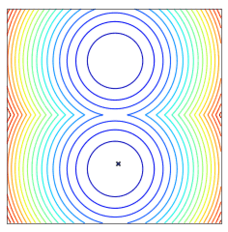

Nevergrad - A gradient-free optimization platform
=================================================

This documentation is a work in progress, feel free to help us update/improve/restucture it!

Quick start
-----------

:code:`nevergrad` is a Python 3.6+ library. It can be installed with:

.. code-block:: bash

    pip install nevergrad

You can find other installation options (including for Windows users) in the :ref:`Getting started section <getting_started>`.

Feel free to join `Nevergrad users Facebook group <https://www.facebook.com/groups/nevergradusers/>`_.

Minimizing a function using an optimizer (here :code:`NGOpt`, our adaptative optimization algorithm) can be easily run with:

.. literalinclude:: ../nevergrad/optimization/test_doc.py
    :language: python
    :dedent: 4
    :start-after: DOC_SIMPLEST_0
    :end-before: DOC_SIMPLEST_1

*Convergence of a population of points to the minima with two-points DE.*

:code:`nevergrad` can also support bounded continuous variables as well as discrete variables, and mixture of those.
To do this, one can specify the input space:

.. literalinclude:: ../nevergrad/parametrization/test_param_doc.py
    :language: python
    :dedent: 4
    :start-after: DOC_README_0
    :end-before: DOC_README_1

Learn more about parametrization in the :ref:`Parametrization section <parametrizing>`!

.. toctree::
   :maxdepth: 3
   :caption: Contents

   getting_started.rst
   optimization.rst
   parametrization.rst
   machinelearning.rst
   optimizers_ref.rst
   parametrization_ref.rst
   benchmarking.rst
   r.rst
   benchmarks.rst
   pyomo.rst
   windows.md
   contributing.rst
   opencompetition2020.md

Citing
------

.. code-block:: bibtex

    @misc{nevergrad,
        author = {J. Rapin and O. Teytaud},
        title = {{Nevergrad - A gradient-free optimization platform}},
        year = {2018},
        publisher = {GitHub},
        journal = {GitHub repository},
        howpublished = {\url{https://GitHub.com/FacebookResearch/Nevergrad}},
    }

License
-------

:code:`nevergrad` is released under the MIT license. See `LICENSE <https://github.com/facebookresearch/nevergrad/blob/master/LICENSE>`_ for additional details about it, as well as our `Terms of Use <https://opensource.facebook.com/legal/terms>`_ and `Privacy Policy <https://opensource.facebook.com/legal/privacy>`_.

Indices and tables
------------------

* :ref:`genindex`
* :ref:`modindex`
* :ref:`search`
