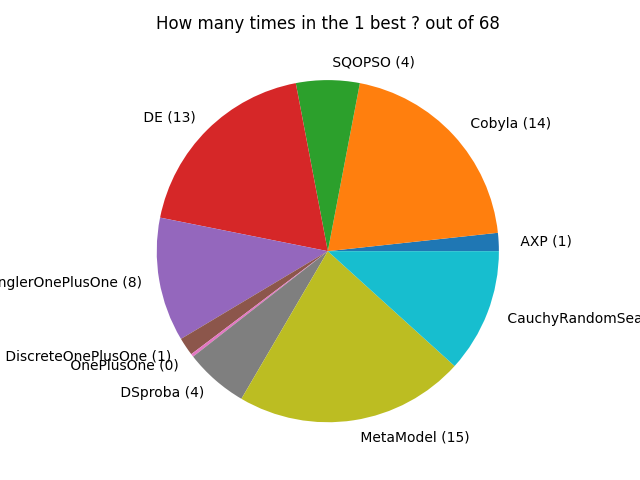
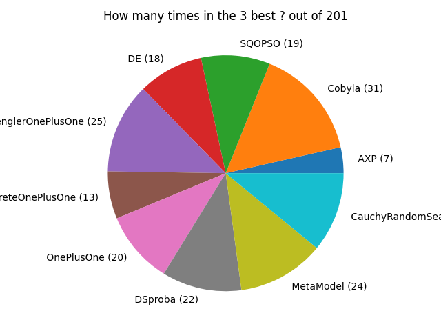
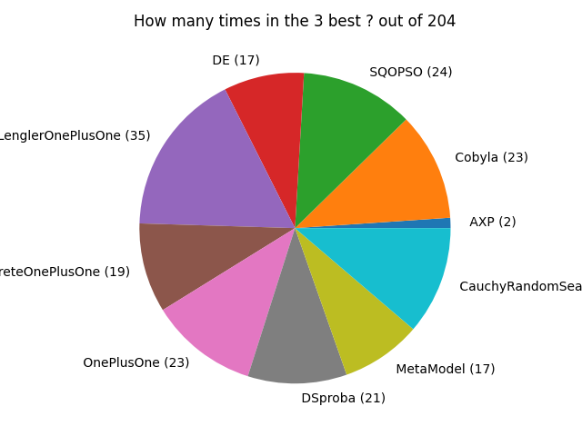

This page records statistics on the benchmarks in Nevergrad.
Contrarily to [[Statistics]], we here exclude wizards and consider only one method per category (Bayesian Optimization, Evolutionary Computation, Direct Search, Particle Swarm, Differential Evolution, Math. Programming...).

Overall, we get excellent for discrete optimization methods, because they are compatible with any search space, any context, and methods (such as wizards) which adapt to different contexts are excluded.

In all cases, we count 0.1 instead of 0 for making figures more readable.

# Comparison on all benchmarks, for the simple regret criterion: the wizard performs best
We record the number of times each algorithm performs best, for the simple regret criterion.

****

# Comparing all methods, with a robustness criterion: the wizard still performs best
Same figure, but with Nevergrad's Robust criterion instead of the simple regret: this means that for each benchmark, instead of the simple regret, we consider the frequency at which a method outperforms the others. We still count how many times each method is best.
****

# Comparing from the point of view of the frequency at which a method is in the three best: methods from discrete optimization perform best
We report the two previous figures, but for the frequency of being in the 3 best instead of the frequency of being the best. Those methods are the most robust and can deal with nearly any context dimension/budget/type/parallelism.
****

The superiority of methods from Discrete Optimization (specifically Lengler) is even more visible in the robust setting.

****
