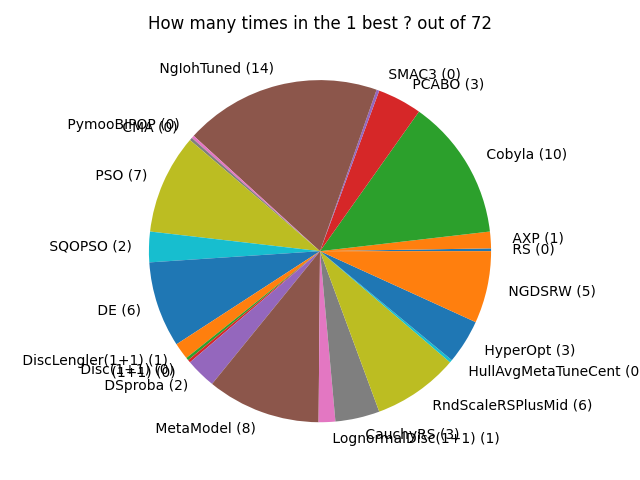

This page records statistics on the benchmarks in Nevergrad.

In all cases, we count +0.2 for making figures more readable (so these figures are not exactly proportional).
Overall, the result is that the wizard NgIohTuned performs best.
As NgIohTuned is a wizard, and given that it is tuned on the same benchamrks, and also because the present document compares many methods possibly close to each other, we maintain another page [[AgStatistics]]
which uses only one method per category (e.g. Random Search, Bayesian Optimization, Evolutionary Computation, Direct Search, Differential Evolution, Particle Swarm Optimization...) and excludes wizards and excludes methods tuned on Nevergrad benchmarks.

# Comparison on all benchmarks, for the simple regret criterion: the wizard performs best
We record the number of times each algorithm performs best, for the simple regret criterion.

****

# Comparing all methods, with a robustness criterion: the wizard still performs best
Same figure, but with Nevergrad's Robust criterion instead of the simple regret: this means that for each benchmark, instead of the simple regret, we consider the frequency at which a method outperforms the others. We still count how many times each method is best.
****

# Comparing from the point of view of the frequency at which a method is in the three best: the wizard NgIohTuned still performs best
We report the two previous figures, but for the frequency of being in the 3 best instead of the frequency of being the best.
****

****
