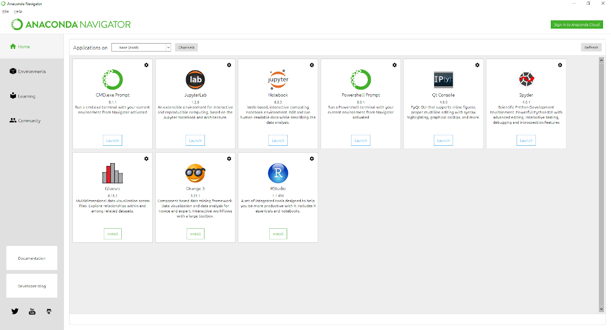
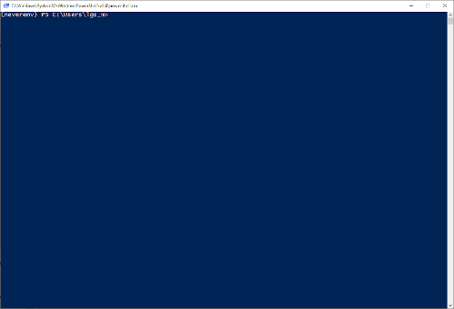
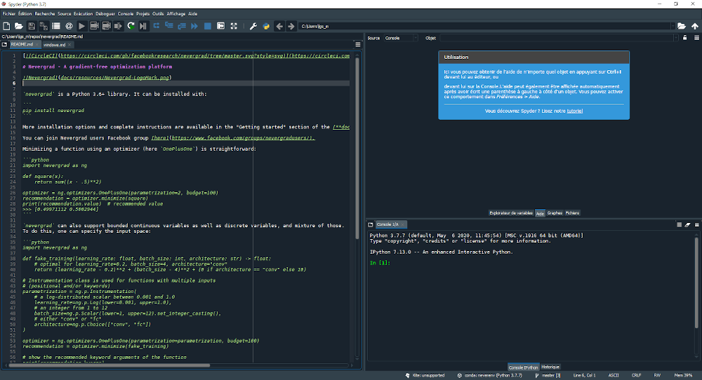
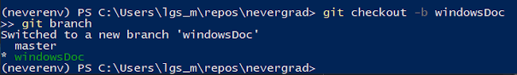
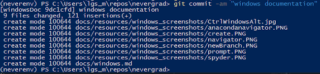
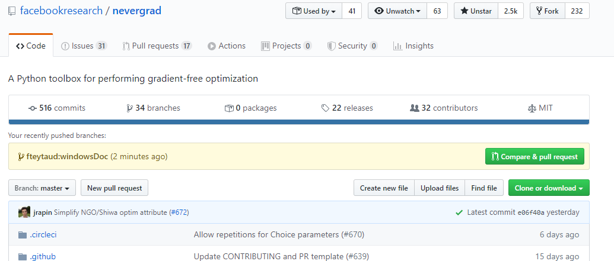

# Installation and configuration on Windows

## Installation of Anaconda and nevergrad

One simple way to work with/on nevergrad is to use anaconda.

First, we have to install Anaconda for Windows.

Please download from [here](https://docs.conda.io/projects/conda/en/latest/user-guide/install/download.html) the version accordingly to your Windows.
For a windows 64 bits you can directly click [here](https://repo.anaconda.com/archive/Anaconda3-2020.02-Windows-x86_64.exe).

Click on the downloaded file to install it. You can let all proposed options by default.
For the installation all you have to do is to click on "*next*" and "*install*", and at the end "*finish*".

Once this is installed, we have to launch it. Click on the windows key on your keyboard 


and start to dial on "*anaconda*" until "*anaconda navigator*" appears. Click on it.


Once the navigator is laucnhed, you should get this:



The navigator is the main menu. From here, you can install, launch different softs, create or launch different environment and so on.

We will create a fresh new environment for nevergrad. In the left menu, click on "*environments*" and then on the *create* button.

You can choose the name you want, and then click on "*create*". 


Now go back to the main page of Anaconda navigator (by clicking on *Home* in the left menu). 
You can see that you are now in the new environment. No soft are installed yet.
First, we will install "*Powershell Prompt*", by clicking on the install button under it.


Once installed, this button becomes a "launch" button, then just launch it.
You have now a terminal launched. 




Dial on 
```
mkdir repos 
cd repos
```

This creates a repository named "*repos*" and goes into it.
Then we will clone nevergrad:
```
git clone https://github.com/facebookresearch/nevergrad.git
```
If you have a fork, you can clone your fork instead (be careful to not have 
the same names).
For instance, I have one, then I do
``` 
git clone https://github.com/fteytaud/nevergrad.git 
```


Finally, to install all the needed packages, follow these commands:

```
cd nevergrad/requirements/
pip install -r main.txt
pip install -r bench.txt
pip install -r dev.txt
conda install pytorch
cd ..
```

Installation is now over

## Adding spyder

**Spyder** is a python ide well integrated in the anaconda environment.
It is used edit/add/read python source code.


To install it: In the anaconda environment select your nevergrad environment (in the "application on" menu).
Then you can install it by clicking on the install button under the spyder case.
You can see other softs you are used to (jupyter, rstudio for instance).



## To run an experiment

Click on the windows key on your keyboard and launch the anaconda navigator, and select you nevergrad environment (in the "application on" menu).

Next, launch a powershell prompt and go in the nevergrad repository with
```
cd repos/nevergrad
```

and launch for instance the parallel experiment:

```
python -m nevergrad.benchmark parallel
```

## To make a pull request

Knowing how to add a pull request is very useful.
For instance, I want to pull request this documentation.

Click on the windows key on your keyboard and launch the anaconda navigator, and select you nevergrad environment (in the "application on" menu).

Next, launch a powershell prompt and go into the nevergrad repository with 
```
cd repos/nevergrad
```

I want to create a new branch, called *windowsDoc*:
```
git checkout -b windowsDoc
```



Then, I add the new files:
```
git add .\docs\windows.md
git add .\docs\resources\windows_screenshots\*
```

and I commit the modification
```
git commit -am "windows documentation"
```



and, finally, I push my commit
```
git push --set-upstream origin windowsDoc
```

This new modification is now pushed on my fork repository.
I need to do a pull request on the main nevergrad repository.

With github it is very simple. First we have to go on the nevergrad projects
([https://github.com/facebookresearch/nevergrad](https://github.com/facebookresearch/nevergrad)).

Here, the fresh push from my fork is automatically detected, and github proposed to 
**compare and pull request**.



Click on this button, check the modification and then you can create the PR by clicking on the *create pull request* button.

The PR will be *reviewed*, possibly *discussed*, and if everything is correct *accepted*.
